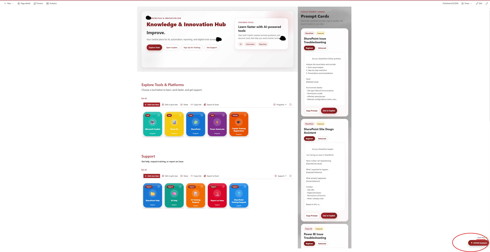

# KIHUB Assistant Bar (SPFx)

This project is a custom SharePoint Framework (SPFx) Application Customizer designed to improve the user experience within SharePoint. It introduces a floating assistant bar that provides quick access to commonly used tools such as Microsoft Copilot and other internal resources.

## Overview

The KIHUB Assistant Bar was created to make navigation within the Knowledge and Innovation Hub more intuitive and efficient. Instead of relying on traditional navigation menus or searching through multiple pages, users can access important tools directly from a floating interface embedded on the page.

The goal of this solution is to simplify how users interact with SharePoint while also encouraging adoption of modern tools and workflows.

## Key Features

- Floating assistant bar with quick access links  
- Easy access to tools like Copilot and internal resources  
- Seamless integration into SharePoint modern pages  
- Clean and non-intrusive user interface  
- Built using SPFx Application Customizer  
- Designed to improve usability and reduce navigation time  

## Business Value

This solution helps improve overall productivity by making important tools easier to access. It reduces the time users spend navigating between pages and creates a more consistent experience across the site.

It also supports adoption of newer tools like Copilot by placing them directly in front of users, rather than requiring them to search for them.

## Tech Stack

- SharePoint Framework (SPFx)  
- TypeScript  
- React  
- Fluent UI  

## Project Structure

src/                SPFx extension source code  
config/             Build and configuration files  
sharepoint/         Solution packaging assets  
assets/             Screenshots and visuals  

## Getting Started (Local Development)

Run the following commands to install dependencies and start the local development server:

npm install  
gulp serve  

## Build and Package

To create a production-ready package, run:

gulp bundle --ship  
gulp package-solution --ship  

## Deployment

1. Upload the generated .sppkg file to the SharePoint App Catalog  
2. Deploy the solution  
3. Add the extension to your target SharePoint site  

## Screenshots

Add your screenshot to the assets folder and reference it below:

## Future Enhancements

Future improvements may include additional assistant bubbles, deeper integration with SharePoint data sources, and more customization options for users.

## Author

Najse Foster  
https://github.com/najsefoster1  

## Notes

This project reflects a broader effort to modernize the SharePoint experience and create more user-friendly, efficient ways for teams to access tools and information.
